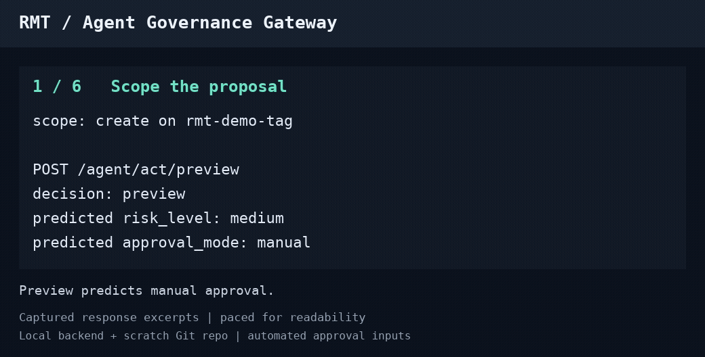

# RMT Platform

**Repository:** [github.com/rajab2030/rmt-platform](https://github.com/rajab2030/rmt-platform)

**Policy checks, approval holds, and execution evidence for AI-agent actions.**

RMT (Risk-Mitigated Transactions) is a general-purpose intelligent control,
execution, and governance platform. Its Agent Governance Gateway demonstrates
how an external agent can propose an operation, inspect a policy/risk preview,
and read the execution outcome. Actions requiring approval are held for an
operator decision.

*Animated excerpts from a recorded local walkthrough; approval inputs automated
for this demo.*
[Transcript, setup, and limitations](docs/assets/agent-governance-demo.md).

[Try the local showcase](tools/rmt-showcase-agent/README.md) ·
[Agent API](docs/operations/AGENT_API.md) ·
[Guarantees and limits](docs/RMT_GUARANTEES.md)

## What the walkthrough shows

The Git-tag showcase uses a disposable repository to demonstrate:

- A grant scoped to an operation and target.
- A policy/risk preview before submitting an action.
- A create proposal and its returned decision.
- A refused attempt to reuse the earlier grant for removal.
- A separately granted removal proposal, approval when required, and the
  reported execution and verification outcomes.

The client displays responses from your local RMT instance; decisions depend
on its configuration. An unavailable verification result is not verified
success. This is an operator walkthrough using one credential, not a
demonstration of independent approver identities.

The showcase client uses Python's standard library. It requires a configured
local RMT backend and a disposable Git repository; no LLM is needed to try it.

## Where RMT fits

RMT targets discrete, observable operations at low-to-moderate volume, with
human approval available for the risky subset. It is intended for
trusted-operator environments. The gateway governs operations submitted
through RMT; host access and operations outside the gateway remain outside
that boundary. See the [threat model](docs/RMT_THREAT_MODEL.md).

The domain-agnostic Core provides the common lifecycle:
**Understand → Decide → Govern → Authorize → Execute → Verify → Learn**.
Domains consume that lifecycle without embedding their rules into Core.
See the [Master Definition](docs/RMT_MASTER_DEFINITION.md) for the platform's
identity and boundaries, and [current project context](RMT_CONTEXT.md) for
the accepted Core state and capabilities built above it.

## Start here

- [`RMT_CONTEXT.md`](RMT_CONTEXT.md) — stable project brain / bootstrap
  context: identity, lifecycle, current status, next action.
- [`docs/RMT_MASTER_DEFINITION.md`](docs/RMT_MASTER_DEFINITION.md) — top
  architecture authority: identity, purpose, Core/domain boundary.
- [`docs/RMT_GUARANTEES.md`](docs/RMT_GUARANTEES.md) — what each lifecycle stage
  does and does **not** assert, in plain language.
- [`docs/RMT_THREAT_MODEL.md`](docs/RMT_THREAT_MODEL.md) — assets, trust
  boundary, assumed adversary, attack surface, residual risks.
- [`docs/operations/AGENT_API.md`](docs/operations/AGENT_API.md) — the
  integration guide for an external agent/caller: full lifecycle, decision
  vocabulary, the evidence-receipt contract, what's guaranteed vs. not.
- [`docs/operations/METRICS.md`](docs/operations/METRICS.md) — every
  `/metrics` signal, the PromQL for decisions/min and approval latency, and
  where RMT's own alerting already lives.
- [`docs/RMT_FROZEN_CORE_DEBT.md`](docs/RMT_FROZEN_CORE_DEBT.md) — every
  recorded frozen-Core gap, its compensating control, and its trigger to
  revisit.
- [`docs/RMT_CAPABILITIES_EVIDENCE.md`](docs/RMT_CAPABILITIES_EVIDENCE.md) —
  the evidence ledger for every capability built on the Core, including live
  exercises.
- [`docs/RMT_IMPROVEMENT_ROADMAP.md`](docs/RMT_IMPROVEMENT_ROADMAP.md) —
  prioritized improvements to the platform as it stands.
- [`docs/RMT_CAP_09_PROPOSAL.md`](docs/RMT_CAP_09_PROPOSAL.md) /
  [`docs/RMT_CAP_09_IMPLEMENTATION.md`](docs/RMT_CAP_09_IMPLEMENTATION.md) —
  **Governed Operations Console (RMT-CAP-09)**: an evidence viewer and approval
  queue, with approve/reject through the existing governed endpoint. See the
  [capability evidence](docs/RMT_CAPABILITIES_EVIDENCE.md) for recorded
  validation and limitations.

## Homelab domain (the platform's first proving ground)

Before RMT governed anything else, it was built and validated against a
real, low-stakes domain: this host's own homelab services. That domain is
still live and still governed by RMT — restarts, health checks, and remediation
all go through the same governed lifecycle as everything else — but it is
the platform's first proof, not its identity.

- Host: Windows + VMware Workstation, guest Ubuntu Server 22.04 LTS, Docker.
- Live, governed services: Portainer, Uptime Kuma, Dozzle.
- All Docker compose files and scripts are version controlled with Git;
  Docker volumes are backed up separately.
