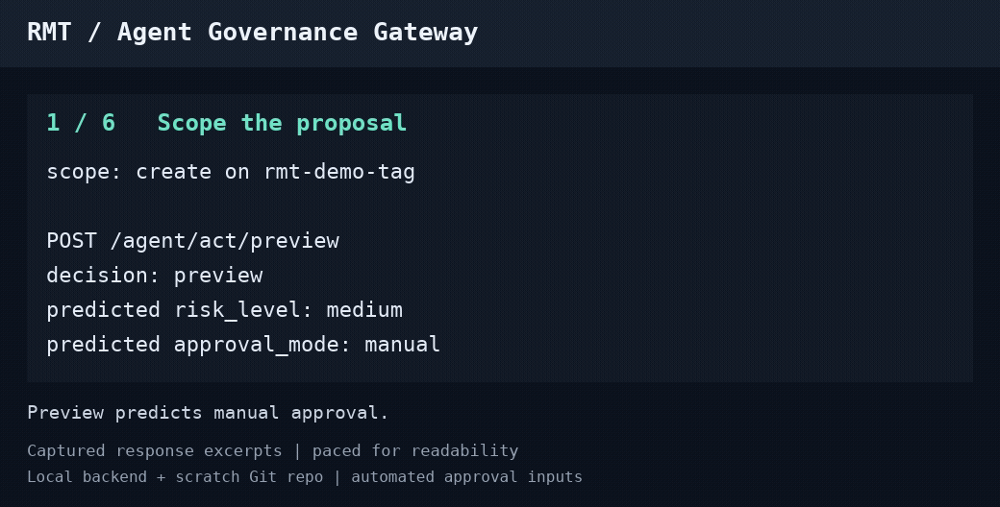

# RMT Platform

[](LICENSE)

**English** · [العربية](README.ar.md)

**Policy checks, approval holds, and execution evidence for AI-agent actions.**

[Project website](https://rajab2030.github.io/rmt-platform/) ·
[Read the Git-tag walkthrough](https://rajab2030.github.io/rmt-platform/agent-action-audit-trail.html) ·
[Ask a question](https://github.com/rajab2030/rmt-platform/discussions)

## The problem

An AI agent wants to run a risky action: delete a Git tag, restart a service,
force-push a branch. **Who decides?** And afterwards, what proves who allowed
it and what actually happened?

## The answer, in three lines

1. **Policy check.** Every action submitted through RMT is policy-checked and
   risk-rated before it can reach an executor. An agent can preview the
   decision first, with no side effects.
2. **Approval hold.** Actions that need approval are held; nothing runs until
   an authenticated operator approves.
3. **Execution evidence.** Each decision, approval, execution and verification
   is recorded in a linked evidence trail that can be exported as a signed
   bundle and checked offline.



*Animated excerpts from a recorded local walkthrough; approval inputs automated
for this demo.*
[Transcript, setup, and limitations](docs/assets/agent-governance-demo.md).

## Try it in about two minutes

You need Docker with Compose v2. No Python, LLM, or secrets.

```bash
git clone https://github.com/rajab2030/rmt-platform.git
cd rmt-platform
docker compose run --rm showcase
```

This builds a local RMT backend (published on `127.0.0.1` only), creates a
disposable Git repository inside the container, and runs a five-act
walkthrough against it. When an action is held, press **Enter** to approve it
as the operator. `docker compose down` stops it and discards all evidence.

What the walkthrough shows:

- A grant scoped to one operation and target.
- A policy/risk preview before submitting an action.
- A create proposal and its returned decision.
- A refused attempt to reuse the earlier grant for removal.
- A separately granted removal proposal, approval when required, and the
  reported execution and verification outcomes.

Details and troubleshooting: [quickstart guide](quickstart/README.md).
Without Docker: [showcase client](tools/rmt-showcase-agent/README.md).

## Limits — what this doesn't claim

- **Trusted operator.** RMT is built for trusted-operator environments. It's
  not a defence against someone who already controls the host.
- **One credential in the demo.** The quickstart turns authentication off, so
  the same `local-dev` identity grants, proposes and approves. It doesn't
  demonstrate independent approver identities.
- **Only what goes through RMT is governed.** Host access and any operation
  outside the gateway stay outside the boundary.
- Approval depends on policy, so not every action needs a human. An absent
  verification result is not a verified success. There is no general
  exactly-once guarantee.

See [guarantees and limits](docs/RMT_GUARANTEES.md), the
[threat model](docs/RMT_THREAT_MODEL.md), and the
[security remediation status](docs/RMT_SECURITY_REMEDIATION.md).

## Govern Claude Code's shell commands (RMT-CAP-10)

The same idea applied to a coding agent. A Claude Code `PreToolUse` hook sends
each Bash command to RMT first. Commands matching a short list of risky
patterns (force-push, hard reset, recursive delete, `git clean -f`, `sudo`,
service restarts) are held for your decision, with a review built only from
checkable evidence, never from an LLM's opinion. Everything else runs
immediately.

It fails open: if RMT is unreachable, including while a command waits for a
decision, the command runs with a warning. It covers only the listed
patterns, and it ships disabled. Treat it as a safety net for a cooperating
agent, not a security boundary.

[Install it in your own project](tools/claude-code-guard/README.md) ·
[capability record](docs/RMT_CAPABILITIES_EVIDENCE.md) (section "RMT-CAP-10").

## Where RMT fits

RMT targets discrete, observable operations at low-to-moderate volume, with
human approval available for the risky subset. It doesn't fit sub-second
latency paths, high-throughput fan-out, or actions with no observable outcome.

The domain-agnostic Core provides the common lifecycle:
**Understand → Decide → Govern → Authorize → Execute → Verify → Learn**.
Domains consume that lifecycle without embedding their rules into Core.
See the [Master Definition](docs/RMT_MASTER_DEFINITION.md) for the platform's
identity and boundaries, and [current project context](RMT_CONTEXT.md) for
the accepted Core state and capabilities built above it.

## Documentation

- [`docs/operations/AGENT_API.md`](docs/operations/AGENT_API.md) — the
  integration guide for an external agent/caller: full lifecycle, decision
  vocabulary, the evidence-receipt contract, what's guaranteed vs. not.
- [`docs/RMT_GUARANTEES.md`](docs/RMT_GUARANTEES.md) — what each lifecycle stage
  does and does **not** assert, in plain language.
- [`docs/RMT_THREAT_MODEL.md`](docs/RMT_THREAT_MODEL.md) — assets, trust
  boundary, assumed adversary, attack surface, residual risks.
- [`docs/operations/METRICS.md`](docs/operations/METRICS.md) — every
  `/metrics` signal, the PromQL for decisions/min and approval latency, and
  where RMT's own alerting already lives.
- [`docs/RMT_CAPABILITIES_EVIDENCE.md`](docs/RMT_CAPABILITIES_EVIDENCE.md) —
  the evidence ledger for every capability built on the Core, including live
  exercises.
- [`docs/RMT_FROZEN_CORE_DEBT.md`](docs/RMT_FROZEN_CORE_DEBT.md) — every
  recorded frozen-Core gap, its compensating control, and its trigger to
  revisit.
- [`docs/RMT_IMPROVEMENT_ROADMAP.md`](docs/RMT_IMPROVEMENT_ROADMAP.md) —
  prioritized improvements to the platform as it stands.
- [`docs/RMT_CAP_09_PROPOSAL.md`](docs/RMT_CAP_09_PROPOSAL.md) /
  [`docs/RMT_CAP_09_IMPLEMENTATION.md`](docs/RMT_CAP_09_IMPLEMENTATION.md) —
  **Governed Operations Console (RMT-CAP-09)**: an evidence viewer and approval
  queue, with approve/reject through the existing governed endpoint.

For contributors and maintainers:
[`CONTRIBUTING.md`](CONTRIBUTING.md) · [`SECURITY.md`](SECURITY.md) ·
[`RMT_CONTEXT.md`](RMT_CONTEXT.md) (project status and next action) ·
[`AGENTS.md`](AGENTS.md) (the operating contract for AI coding agents).

## Homelab domain (the platform's first proving ground)

Before RMT governed anything else, it was built and validated against a
real, low-stakes domain: this host's own homelab services. That domain is
still live and still governed by RMT — restarts, health checks, and remediation
all go through the same governed lifecycle as everything else — but it is
the platform's first proof, not its identity.

- Host: Windows + VMware Workstation, guest Ubuntu Server 22.04 LTS, Docker.
- Live, governed services: Portainer, Uptime Kuma, Dozzle.
- All Docker compose files and scripts are version controlled with Git;
  Docker volumes are backed up separately.

## License

[MIT](LICENSE)
